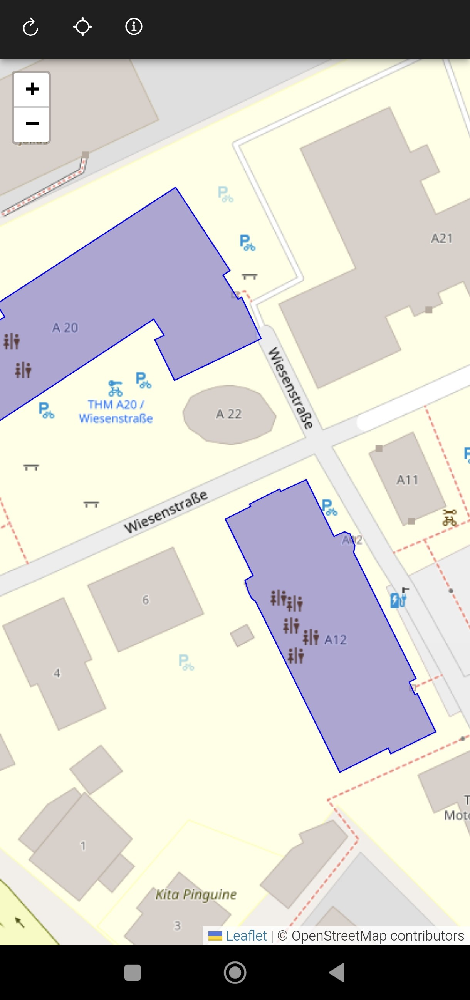

## Einführung
Das Repository enthält die Anwendung zur Verwaltung von Kalibrierungspunkten von MoCaInfo. 
Entwickelt wurde diese mit Ionic und Angular. 
Die Anwendung umfasst eine Web-App und eine native Android-App.

Ziel der Anwendung ist es, einem Benutzer eine einfache und effizente Möglichkeit zu bieten, um die Kalibrieriungspunkte zu verwalten. 
Verwendet werden die Kalibrierungspunkte von dem WiFi-basierten Fingerprintingsystem um möglichst genaue Positionierungen durchführen zu können.
Durch die visuelle Darstellung der Kalibrieriungspunkte können diese einfach und effizent verwaltet werden und dem Fingerprintingsystem so genaue Messungen für eine Positionierung zur Verfügung gestellt werden.

In der Anwendung wird eine interaktive Karte angezeigt, in der unterschiedliche THM-Gebäuden in Gießen durch eine Umradung gekennzeichnet werden. Die Gebäudeinformationen werden über den [Indoor-Data-Service](https://git.thm.de/mocainfo/indoor-model-backend) von MoCaInfo abgerufen. 

Bei gekennzeichneten Gebäuden kann in eine Innenraumansicht gewechselt werden. In dieser Innenraumansicht werden die verfügbaren Kalibrierungspunkte des Gebäudes und Stockwerkes visuell als interaktiver Punkt eingezeichnet. 
Es besteht die Möglichkeit einen bestehenden Kalibrierungspunkt zu betrachten, zu bearbeiten, zu löschen oder einen neuen hinzuzufügen. 
Ein neuer Kalibrieriungspunkt kann einfach über einen Klick in den Innenraum erstellt werden. 
Ein Kalibrieriungspunkt wird definiert durch ein Ortskoordinate (Längen- und Breitengrad) und die Gebäudeinformation (Gebäude und Stockwerk).
Abgerufen werden die Kalibrierungspunkte über den [Fingerprinting-Service](https://git.thm.de/mocainfo/positioning-services/positioning-fingerprinting-service-ktor) von MoCaInfo.

### Versionen
Die Anwendung wurde auf den Stand von folgenden Versionen entwickelt:
- Ionic CLI: 7.2.0
- Angular CLI: 17.2.1
- Angular: 17.2.3
- Capacitor: 10.4.0 
- OS: win32 x64 (win11)
- Node: 20.11.1
- Package Manager: npm 10.4.0
- Java: 17.0.5

## Setup
1. Projekt aus Git-Repository clone  `git clone https://git.thm.de/bachelor-abschlussphase-wise23_24/bachelorarbeit`
2. Terminal in dem Verzeichnis öffnen oder dort rein navigieren   `cd {$projektverzeichnis}`
3. Abhängigkeiten des Projekts installierennpm   `npm install`
4. Projekt lokal starten   `ionic serve` 
5. Android-Plattform zum Projekt hinzufügen (falls noch nicht vorhanden)   `ionic cap add android`
6. Erstellen der Produktionsversion  `ng build--configuration production` 
7. Synchronisation mit der Android-Plattform   `ionic cap sync android`
8. Start der App auf einem physischen Gerät   `ionic cap run android -l --external` 